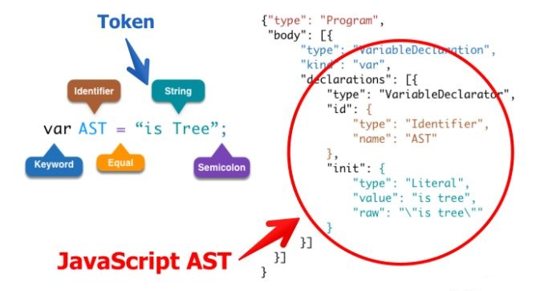
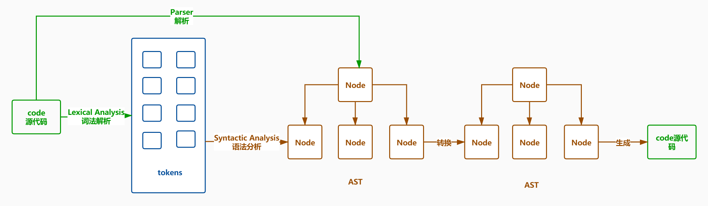

## rollup

#### tree-shaking

- Tree-shaking 的本质是消除无用的 js 代码
- rollup 只处理函数和顶层的 import/export 变量

```js
// rollup 本身不能识别第三方依赖模块
import _ from 'lodash'
console.log(_)

(!) Unresolved dependencies
https://rollupjs.org/troubleshooting/#warning-treating-module-as-external-dependency

```

- magic-string 是一个操作字符串和生成 source-map 的工具

```js
var MagicString = require("magic-string");
let sourceCode = `export var name = "zhufeng"`;
let ms = new MagicString(sourceCode);
console.log(ms);
//裁剪出原始字符串开始和结束之间所有的内容
//返回一个克隆后的MagicString的实例
console.log(ms.snip(0, 6).toString()); //sourceCode.slice(0,6);
//删除0, 7之间的内容
console.log(ms.remove(0, 7).toString()); //sourceCode.slice(7);

//还可以用用来合并代码 //TODO
let bundle = new MagicString.Bundle();
bundle.addSource({
  content: "var a = 1;",
  separator: "\n",
});
bundle.addSource({
  content: "var b = 2;",
  separator: "\n",
});
console.log(bundle.toString());
```

### 2.3. AST

- 通过 `JavaScript Parser` 可以把代码转化为一颗抽象语法树 AST,这颗树定义了代码的结构，通过操纵这颗树，我们可以精准的定位到声明语句、赋值语句、运算语句等等，实现对代码的分析、优化、变更等操作



#### 2.3.1 AST 工作流

- Parse(解析) 将源代码转换成抽象语法树，树上有很多的 estree 节点
- Transform(转换) 对抽象语法树进行转换
- Generate(代码生成) 将上一步经过转换过的抽象语法树生成新的代码



#### 2.3.2 acorn

- astexplorer 可以把代码转成语法树
- acorn 解析结果符合 `The Estree Spec` 规范
